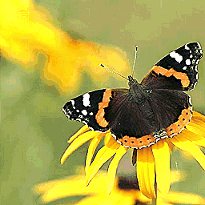
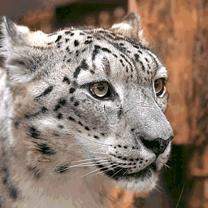
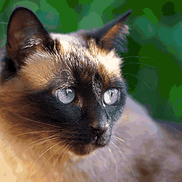
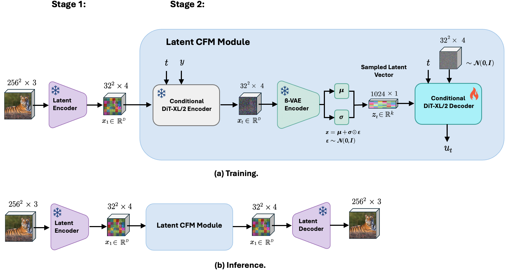

# 🚀 NoiseGuided-SmoothLFM


> **Noise-guided latent flow matching for smooth, controllable image generation through representation-learning based classifier-guidance.**

<p align="center">
  
  
  
</p>


---

## ✨ Highlights

- 🌀 **Noise-guided latent smoothness** for continuous morphing and perceptually stable interpolations.
- 🚀 Built on **Scalable Interpolant Transformers (SiT)** and latent diffusion.
- 🔬 Extensive quantitative evaluations: PCA, UMAP, linear probes, ISTD, LDPL metrics.
- 🎥 Supports advanced metrics: FID, Inception Score, LPIPS, SSIM, PSNR, and custom smoothness metrics.
- 💥 Enables **creative editing**, seamless transitions, and robust self-guidance.

---

## 🧠 Framework Architecture

<p align="center">
  
</p>

*Figure: High-level architectural overview of the NoiseGuided-SmoothLFM pipeline.*

---

## ⚙️ Tech Stack & Frameworks

- 💻 **PyTorch 2.5.1**
- 🔥 **Lightning 2.5.0**
- 🌀 <a href="https://github.com/joh-schb/image-ldm" title="Built by Johannes Schusterbauer"><strong>Latent Diffusion Model (Image-LDM)</strong></a>
- 🌊 **SiT (Scalable Interpolant Transformers)**
- 🎨 **Hydra**, **OpenCLIP**, **WandB**, TensorBoard
- 🛠️ Extras: torchdiffeq, xformers, albumentations, UMAP

---

## 🌊 Smooth Interpolations

Large-scale generative models such as Diffusion Models and the recent Flow Matching (FM) paradigm have demonstrated remarkable synthesis capabilities (Dhariwal & Nichol, 2021; Lipman et al., 2023; Albergo et al., 2023). However, their capacity for robust and structured representation learning remains largely underexplored. Continuous-time architectures, including Scalable Interpolant Transformers (SiT) (Ma et al., 2024), have yet to be rigorously evaluated regarding their ability to learn compact, semantically meaningful latent spaces.

By design, Diffusion and Flow-based models lack explicit architectural constraints or dedicated modules for enforcing smooth, disentangled feature extraction. While this choice preserves sample fidelity and diversity, it inherently limits interpretability and fine-grained control (Fuest et al., 2024).

In contrast to supervised or heavily engineered methods, our approach introduces a fully self-supervised, representation-learning-based guidance mechanism. By integrating a tunable β-VAE encoder, we extract compact, smooth latent codes directly from pretrained generative backbones. This enables semantically coherent interpolations without external annotations or handcrafted constraints, providing a scalable and interpretable solution.

Evaluating interpolation behavior — for example, via linear interpolations or latent space walks — offers an intuitive and interpretable means of assessing representation quality. While prior works have explored smoother latent traversals and morphing capabilities (Guo et al., 2024; Zhang et al., 2024), these typically rely on explicit supervision, complex augmentation pipelines, or auxiliary conditioning networks, which introduce additional complexity and reduce scalability.

Our framework is lightweight, architecture-agnostic, and directly applicable to a wide range of Diffusion and Flow-based backbones without retraining.

> 🎯 **Our method enables smooth, continuous transitions between images while preserving fine-grained semantic details and global structure.** This facilitates creative interpolations, intuitive attribute editing, and robust exploratory latent space walks — all while maintaining high sample quality and diversity.

---

## 💡 Motivation

The framework addresses fundamental trade-offs in generative models: **sample quality, diversity, and speed**, while introducing a pathway to improved interpretability through an auxiliary ß-VAE encoder.  
It leverages deterministic continuous flows rather than stochastic noise schedules, resulting in smoother and more controllable outputs.

---

## ⚡ Quick Start

```bash
# Clone
git clone https://github.com/JaninaMattes/NoiseGuided-SmoothLFM.git
cd NoiseGuided-SmoothLFM

# Create environment
conda create -n ldm-env python=3.12
conda activate ldm-env

# Install core packages
conda install pytorch=2.5.1 torchvision pytorch-cuda=12.4 -c pytorch -c nvidia
conda install lightning=2.5.0 -c conda-forge
conda install -c conda-forge pillow matplotlib einops timm h5py pandas webdataset tensorboard wandb

# Additional packages
pip install hydra-core --upgrade
pip install torch-fidelity torchdiffeq open_clip_torch notebook lpips pytorch-fid moviepy umap-learn
pip install -U xformers --index-url https://download.pytorch.org/whl/cu124
pip install git+https://github.com/joh-schb/jutils.git#egg=jutils

# Run training
python train.py --config configs/your_config.yaml
```
---

## Rsource
[0] Dhariwal & Nichol (2021), "Diffusion Models Beat GANs on Image Synthesis."

[1] Ma et al. (2024), "SiT: Stochastic interpolant transport for generative modeling."

[2] Guo et al. (2024), "Smooth Diffusion: Crafting Smooth Latent Spaces in Diffusion Models."

[3] Zhang et al. (2024), "DiffMorpher: Unleashing the Capability of Diffusion Models for Image Morphing."

[4] Fuest et al. (2024), "Diffusion Models and Representation Learning: A Survey."

[5] Lipman et al. (2023), "Flow Matching for Generative Modeling."

[7] Albergo et al. (2023), "Stochastic Interpolants: A Unifying Framework for Flows and Diffusions."

