<!-- Improved compatibility of back to top link: See: https://github.com/othneildrew/Best-README-Template/pull/73 -->
<a name="readme-top"></a>
<!--
*** Thanks for checking out the Best-README-Template. If you have a suggestion
*** that would make this better, please fork the repo and create a pull request
*** or simply open an issue with the tag "enhancement".
*** Don't forget to give the project a star!
*** Thanks again! Now go create something AMAZING! :D
-->


<!-- PROJECT SHIELDS -->
<!--
*** I'm using markdown "reference style" links for readability.
*** Reference links are enclosed in brackets [ ] instead of parentheses ( ).
*** See the bottom of this document for the declaration of the reference variables
*** for contributors-url, forks-url, etc. This is an optional, concise syntax you may use.
*** https://www.markdownguide.org/basic-syntax/#reference-style-links
-->
[![Contributors][contributors-shield]][contributors-url]
[![Forks][forks-shield]][forks-url]
[![Stargazers][stars-shield]][stars-url]
[![Issues][issues-shield]][issues-url]
[![MIT License][license-shield]][license-url]
[![LinkedIn][linkedin-shield]][linkedin-url]


<h1 align="center"> Noise Guided Smooth LFM</h1>


<!-- PROJECT LOGO -->
<br />
<div align="center">
  <a href="https://github.com/JaninaMattes/NoiseGuided-SmoothLFM.git">
    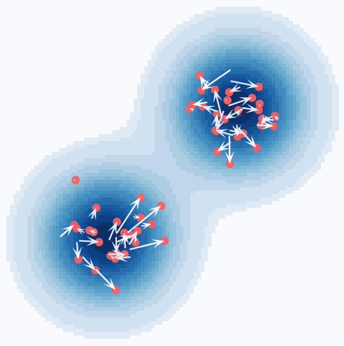
  </a>

<h3 align="center">Exploring Self-Supervised Representation Learning for Interpretability and Control in Flow and Diffusion-based Generative Models</h3>

  <p align="center">
    The purpose of this work is to explore how established self-supervised representation learning methods can be utilised for interpreting and guiding the behaviour of state-of-the-art Flow and Diffusion-based generative models.
    <br />
    <a href="https://github.com/JaninaMattes/NoiseGuided-SmoothLFM"><strong>Explore the docs »</strong></a>
    <br />
    <br />
    <a href="https://github.com/JaninaMattes/NoiseGuided-SmoothLFM">View Demo</a>
    ·
    <a href="https://github.com/JaninaMattes/NoiseGuided-SmoothLFM/issues">Report Bug</a>
    ·
    <a href="https://github.com/JaninaMattes/NoiseGuided-SmoothLFM/issues">Request Feature</a>
  </p>
</div>


<!-- <p align="center">
  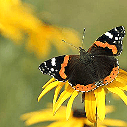
  
  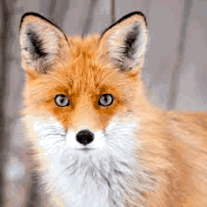
  
</p>

<p align="center">
  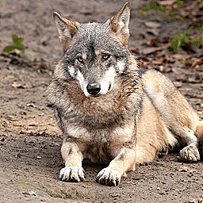
  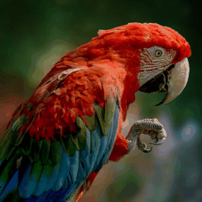
  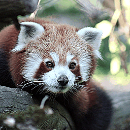
  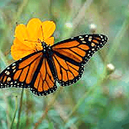
</p> -->

This repo contains PyTorch model definitions, pre-trained weights and training/sampling code for experiments over ImageNet 256 × 256.

<!-- ABOUT THE PROJECT -->
## About The Project

<div align="center">

<table>
  <tr>
    <td colspan="2" align="center">
      
    </td>
    <td colspan="2" align="center">
      
    </td>
  </tr>
  <tr>
    <td align="center"></td>
    <td align="center">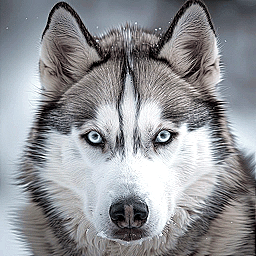</td>
    <td align="center"></td>
    <td align="center">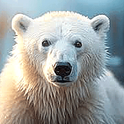</td>
  </tr>
</table>

</div>

## Background: Diffusion Models & Gaussian Flow Matching

Flow Matching and Diffusion Models are two dominant frameworks for generative modeling in vision. This work treats them as interchangeable, a choice that is mathematically justified: **ODE-based Diffusion Models and Gaussian Flow Matching are equivalent** when the source distribution is Gaussian. Different parameterizations yield different noise schedules and loss weightings, but they define the same generative model.


### Diffusion Models

A diffusion process gradually corrupts a data point $\mathbf{x}$ (e.g. an image) by progressively mixing it with Gaussian noise:
```math
\mathbf{x}_t = \alpha_t\,\mathbf{x} + \sigma_t\,\boldsymbol{\epsilon}, \qquad \boldsymbol{\epsilon} \sim \mathcal{N}(\mathbf{0}, \mathbf{I})
```

where $\alpha_t$ and $\sigma_t$ define the **noise schedule**, whereby this work uses the **variance-preserving** schedule ($\alpha_t^2 + \sigma_t^2 = 1$), ensuring the process transitions smoothly from clean data at $t=0$ to pure noise at $t=1$.

<details>
<summary><b>Reverse Process & DDIM Sampler</b></summary>
<br>

To generate new samples, we reverse the forward process:

1. **Initialize** $\mathbf{z}_1 \sim \mathcal{N}(\mathbf{0}, \mathbf{I})$
2. **Denoise**: predict the clean sample with a neural network (denoiser): $\hat{\mathbf{x}} = \hat{\mathbf{x}}(\mathbf{x}_t;\, t)$
3. **Project back** to a lower noise level $s < t$:
```math
\mathbf{z}_{s} = \alpha_{s}\,\hat{\mathbf{x}} + \sigma_{s}\,\hat{\boldsymbol{\epsilon}}, \qquad \hat{\boldsymbol{\epsilon}} = \frac{\mathbf{x}_t - \alpha_t\,\hat{\mathbf{x}}}{\sigma_t}
```

4. **Repeat** steps 2–3 from $t=1$ toward $t=0$ until $\hat{\mathbf{x}}$ is recovered.

> [!NOTE]
> This is the **DDIM sampler**. All stochasticity is concentrated in the initial sample $\mathbf{z}_1$, the entire reverse process is deterministic.

</details>

<p align="right">(<a href="#readme-top">back to top</a>)</p>


### Flow Matching

The forward process is a **linear interpolation** between data $\mathbf{x}$ and noise $\boldsymbol{\epsilon}$:
```math
\mathbf{x}_t = (1 - t)\,\mathbf{x} + t\,\boldsymbol{\epsilon}, \qquad t \in [0, 1]
```

This recovers the diffusion forward process under the schedule $\alpha_t = 1-t,\; \sigma_t = t$. The evolution between timesteps $s < t$ is then **linear**:
```math
\mathbf{x}_t = \mathbf{z}_s + \mathbf{u}\,(t - s)
```

where $\mathbf{u} = \boldsymbol{\epsilon} - \mathbf{x}$ is the **velocity field**. Rather than predicting noise (as in DDPM), **our model learns to predict this velocity directly**, tracing a straight-line path from data to noise. Such trajectories are smoother and hence reduce path curvature compared to curved diffusion paths, which is advantageous at inference.

> [!NOTE]
> Lower curvature means fewer NFE (Number of Function Evaluations) — faster and computationally cheaper generation, with less accumulated numerical error during discretisation.
### Probability Flow ODE

Song et al. show that any stochastic diffusion Stochastic Differential Equation (SDE) can be reformulated as a deterministic **probability flow ODE**, while preserving identical marginal densities $p_t(\mathbf{x})$ at every timestep. This means noise injection is not required during generation.

<p align="center">
  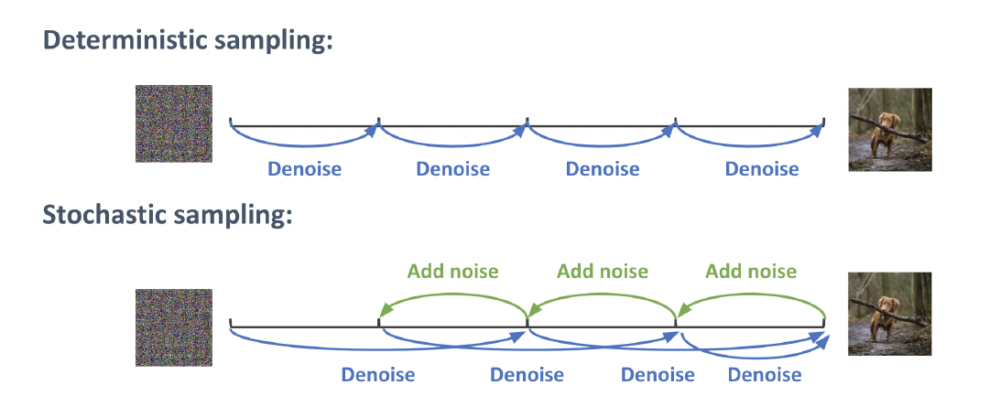
</p>

<details>
<summary><b>SDE to ODE Equivalence</b></summary>
<br>

*(Add derivation or Song et al. formulation here.)*

</details>

New samples are generated from $\mathbf{z}_1 \sim \mathcal{N}(\mathbf{0}, \mathbf{I})$ by discretising the reverse-time ODE with a numerical solver. This work uses the **first-order Euler method**.


<p align="right">(<a href="#readme-top">back to top</a>)</p>


### Stochastic Interpolant Framework

The **stochastic interpolant** framework [(Albergo & Vanden-Eijnden, 2023)](https://arxiv.org/abs/2209.15571) provides a principled way to construct a time-dependent probability path $\rho(t)$ that bridges any source density $\rho_0$ (e.g. Gaussian noise) and target density $\rho_1$ (e.g. natural images). Crucially, the design of this interpolant is **decoupled from the choice of sampler**, the same learned $\rho(t)$ can be sampled with either a deterministic ODE or a stochastic SDE.

This work builds on the **SiT (Scalable Interpolant Transformer)** architecture [(Ma et al., 2024)](https://arxiv.org/abs/2401.08740), which applies the stochastic interpolant framework at scale for image synthesis. SiT replaces the denoising objective of Diffusion Transformer (DiT) [(Peebles & Xie, 2023)](https://arxiv.org/abs/2212.09748) with a velocity prediction objective, inheriting the flexibility of the interpolant framework while retaining the scalability of transformer-based Diffusion Models.

<p align="center">
  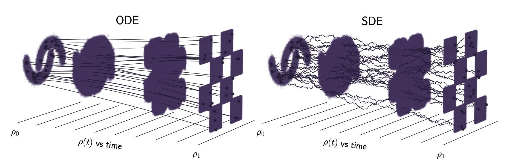
</p>

> Both samplers trace different trajectories but share the same marginal density $\rho(t)$ at every timestep $t$ — a result established by Song et al. This means ODE and SDE samplers are interchangeable without retraining.


<p align="right">(<a href="#readme-top">back to top</a>)</p>


## Architecture

The framework follows the standard Latent Diffusion Model architecture introduced by Stable Diffusion, adopting a two-stage process that operates entirely in a learned lower-dimensional latent space. The β-Variational Autoencoder (ß-VAE) follows a ViT-based architecture, whereas the diffusion backbone is based on Scalable Interpolant Transformers (SiT).

### Hybrid Representation Learning Framework

The core motivation behind this framework is to jointly optimise for three desirable properties:

**Representation Quality**
- A lower-dimensional latent space that is both decodable and semantically meaningful
- Disentangled, smooth latent codes that improve human interpretability and with it model behaviour steerability

**Controllable Generation**
Controllability is one of the most important characteristics of generative models, as it allows synthesis to be closely conditioned on a guidance signal — here, the non-spatial Self-Guidance code extracted by the $\beta$-VAE encoder.

**Inference Efficiency**
High-fidelity generation is only practically useful if inference is fast enough for real-world deployment. This framework targets both simultaneously.

<p align="center">
  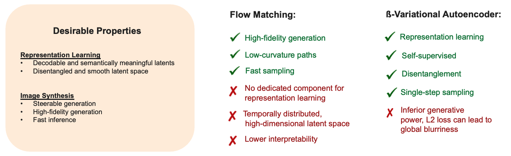
</p>


<p align="right">(<a href="#readme-top">back to top</a>)</p>

### Stage 1: Semantic Compression

Rather than operating directly in high-dimensional pixel space, this work follows the **Latent Diffusion Model** paradigm [(Rombach et al., 2022)](https://arxiv.org/abs/2112.10752), the foundation behind Stable Diffusion, where the diffusion process is learned entirely in a compressed latent space. 

<p align="center">
  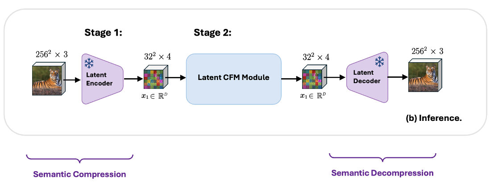
</p>

This work utilises the open-source available and pre-trained, Stable Diffusion CNN-VAE encoder and decoder are utilised for semantic compression and decompression over ImageNet 256 × 256. Together, they are defining the fixed latent space in which the Conditional Flow Matching module is then trained. Operating in a slightly compressed latent space reduces not only computational complexity, but also benefits from a lower-variance, more regularised Gaussian latent space.

#### Latent Space Compression via CNN-VAE

A pre-trained **CNN-VAE** encoder maps each image $\mathbf{x} \in \mathbb{R}^{H \times W \times 3}$ into a lower-dimensional latent code $\mathbf{z} \in \mathbb{R}^{h \times w \times c}$, on which the Flow Matching objective is applied. While the latent samples remain "image-like", a slight compression is computationally advantageous: the latent space is significantly smaller than pixel space, reducing both memory and the number of forward passes required during training and inference.


<p align="center">
  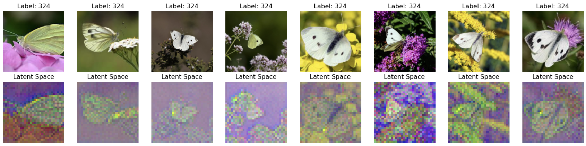
</p>

The figure compares ground-truth ImageNet samples (pixel space) with their CNN-VAE latent representations. The latent codes are 4-channel tensors, visualised here by dropping the 4th channel to produce a plottable RGB image. While they no longer look like natural images, they retain the spatial structure that the Diffusion or Flow Matching model then learns to generate before it is mapped back to the output space.

<p align="right">(<a href="#readme-top">back to top</a>)</p>

### Stage 2: Latent Conditional Flow Matching (CFM)

<p align="center">
  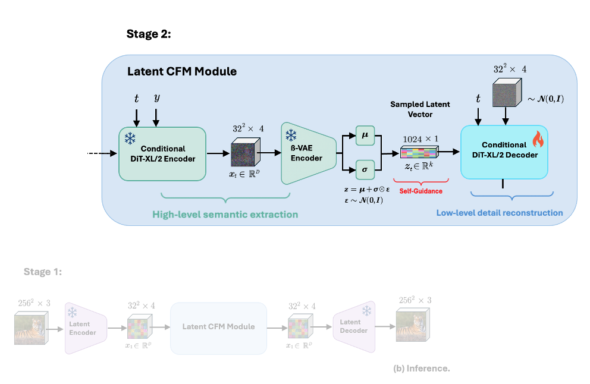
</p>

This work is built on the SiT framework, learning ODE-based models to follow straight trajectories connecting a Gaussian source distribution $\pi_0$ and the ImageNet $256 \times 256$ target distribution $\pi_1$ as directly as possible.


#### Flow Matching Decoder (DiT-XL/2)

To address the high-frequency information loss (e.g. fine-grained stochastic details, hair strains etc.) inherent when using a $\beta$-Variational Autoeoncder (VAE) when operating within the learned Flow Matching latent noise space, this work adopts a **decoupled two-model design**:

- A **forward-time class-conditional DiT-XL/2 encoder** that extracts high-level semantic features from the noisy latent $\mathbf{x}_t$
- A **reverse-time self-conditional DiT-XL/2 decoder** that reconstructs the missing high-frequency detail conditioned on ß-VAE features to recover the target sample $\mathbf{x}_0$

Rather than relying on a single module to both denoise and reconstruct, each model is free to specialise for its respective task.

The two models are coupled via a **Self-Guidance** mechanism, which acts as an information channel between encoder and decoder during synthesis. Self-Guidance extends classical classifier-free guidance [(Ho & Salimans, 2022)](https://arxiv.org/abs/2207.12598) beyond discrete class labels, conditioning the decoder not only on class information but also on the **continuous embedding vector** extracted by the pre-trained and frozen $\beta$-VAE encoder. This allows the decoder to recover structural and perceptual detail that the $\beta$-VAE bottleneck would otherwise discard. The learned conditional probability paths are illustrated below.

<p align="center">
  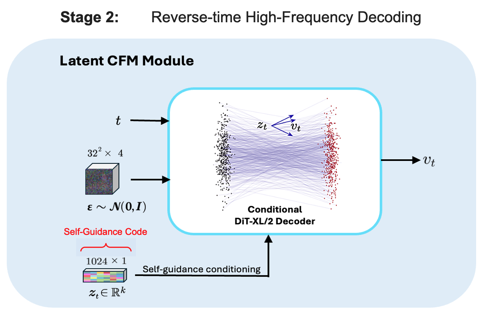
</p>

#### $\beta$-Variational Autoencoder ($\beta$-VAE)

Classical Autoencoders [(Hinton & Salakhutdinov, 2006)](https://www.science.org/doi/10.1126/science.1127647) make use of an encoder and decoder network, trained in a fully self-supervised way to reconstruct the original input while learning a compressed intermediate representation, a form of dimensionality reduction.

A **Variational Autoencoder (VAE)** [(Kingma & Welling, 2014)](https://arxiv.org/abs/1312.6114) does not map the input to a fixed vector, but instead to a Gaussian distribution $p_\theta$, parameterised by $\theta$. The **$\beta$-VAE** extends this by seeking to map data points to latent codes that follow a structured, disentangled Gaussian distribution, from which data can be generated and manipulated. The model is made trainable by explicitly learning the mean $\boldsymbol{\mu}$ and variance $\boldsymbol{\sigma}^2$ of the distribution via the **reparameterisation trick**, which separates the deterministic parameters from the stochastic random variable $\boldsymbol{\epsilon} \sim \mathcal{N}(\mathbf{0}, \mathbf{I})$:
```math
\mathbf{z} = \boldsymbol{\mu} + \boldsymbol{\sigma} \odot \boldsymbol{\epsilon}
```

If each variable in the inferred latent representation 
 is only sensitive to one single generative factor and relatively invariant to other factors, we will say this representation is disentangled or factorized. One benefit that often comes with disentangled representation is good interpretability and easy generalization to a variety of tasks.


The architecture is based on a highly scalable Vision Transformer (ViT) architecture design which makes use of patch embeddings and Transformer blocks. 

<p align="center">
  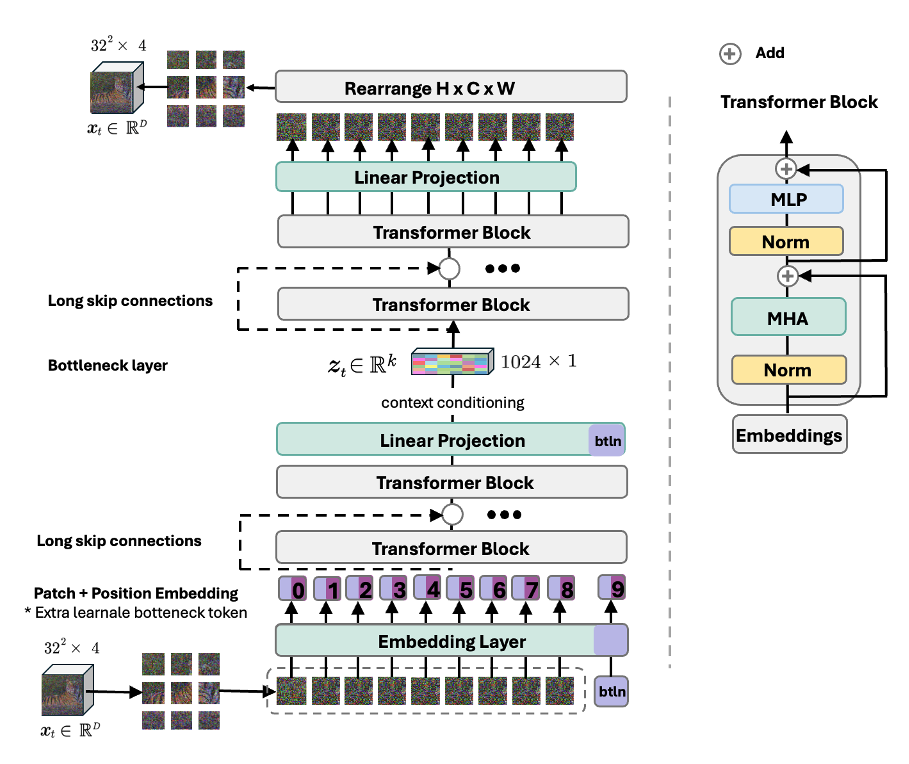
</p>

The modules additionally introduces cross-attention skip connections in encoder and decoder to control the flow of information from earlier to later layers. Improves gradient flow during training.
Preserves fine-grained input details, especially under high input noise settings.


Both the Flow Matching module and the β-VAE operate entirely within the fixed CNN-VAE autoencoder latent space, thereby shaping the prior distribution. Together the CFM module allows for abstract high-level feature information extraction and detailed object appearance recovery. 


<p align="right">(<a href="#readme-top">back to top</a>)</p>


## Training Dataset

The $\beta$-VAE training data is derived from the pre-trained Flow Matching model directly, due to which no external dataset, nor annotations are required. When running the neural ODE forward each latent image $\mathbf{x}_0$ is mapped to a unique, corresponding noise sample $\mathbf{x}_t$ in the learned noise space. To avoid limiting sample diversity, the classifier-free guidance scale is fixed at $w = 1$ (unconditional) throughout. 

#### Forward Diffusion Process

Applying the ODE-based forward process to a compressed latent code $\mathbf{x}_0$ produces a sequence of progressively noisier latent representations $\mathbf{x}_t$ at increasing timesteps $t \in [0, 1]$:

<p align="center">
  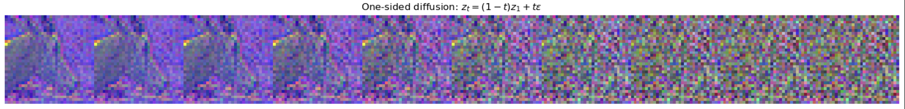
  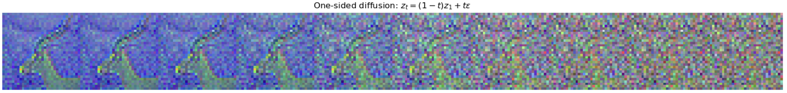
  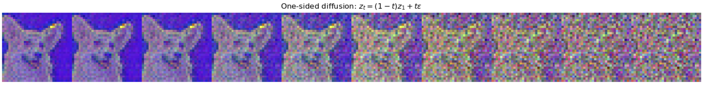
</p>

For temporal coverage, pairs $(\mathbf{x}_t, \mathbf{x}_0)$ are collected at subsampled timesteps:
```math
t \in \{0.0,\ 0.2,\ 0.5,\ 0.7,\ 0.8\}
```

> **Note:** The visualisations above are not representative of the true latent space as the 4th channel is dropped for RGB plotting purposes only. Alternatively convolution can be used to enforce a 3-channel output.


#### Building "Guidance-Free" Noise Spaces

This work is motivated by the previously described **deterministically structured noise spaces** [(Preechakul et al., 2021)](https://arxiv.org/abs/2111.15640), referred to here as *"Guidance-Free"* [(Zhou et al., 2024)](https://arxiv.org/abs/2411.09502). Under ODE-based Flow Matching we perform interpolation between Gaussian noise and image samples. Hence, the learned noise samples $\mathbf{x}_t$ along the conditional probability path are unique as they retain all necessary high-level semantic information about their input $\mathbf{x}_0$ (e.g., colour, shape, location, object identity, silhouette) which allows almost full reconstruction (i.e., cycle-consistency). This enables high-quality image synthesis **without classifier-free guidance** [(Ho & Salimans, 2022)](https://arxiv.org/abs/2207.12598).


<p align="center">
  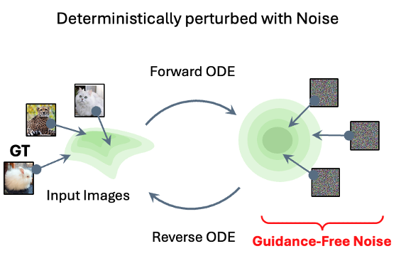
</p>


This is possible because samples $\mathbf{x}_t$ generated deterministically along the probability path are **unique** since they retain the necessary high-level semantic information about the original sample $\mathbf{x}_0$, including silhouette, colour, shape, and location. As a result, the forward and reverse processes form a consistent cycle: encoding $\mathbf{x}_0 \to \mathbf{x}_1$ and decoding $\mathbf{x}_1 \to \mathbf{x}_0$ recovers the original up to the numerical error introduced by ODE discretisation, a property known as **cycle consistency**.


<p align="right">(<a href="#readme-top">back to top</a>)</p>

#### Latent Denoising via $\beta$-VAE

To learn structure within the learned Flow Matching noise space, the **$\beta$-VAE** receives a noisy latent sample $\mathbf{x}_t$ (e.g. at $t = 0.5$) and learns to extract high-level semantic features of the target distribution — including location, shape, colour, and silhouette — producing a compressed, non-spatial vector code.

The figure below compares ground-truth ImageNet 256×256 samples against clean $\beta$-VAE reconstructions decoded back to image space by a fixed CNN-VAE decoder. Accounting for CNN-VAE decoding errors, this broadly illustrates what semantic information the model retains:

<p align="center">
  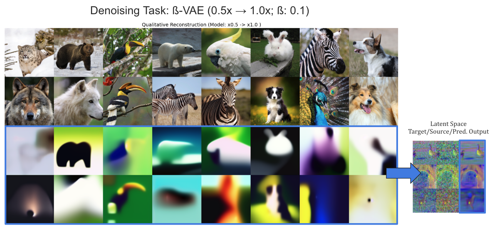
</p>

While the $\beta$-VAE successfully recovers coarse semantic structure, it cannot reintroduce **high-frequency detail** destroyed during the forward corruption process. Even with a bottleneck size of 1024, object textures, fine edges, and sharp boundaries remain irrecoverable. The right panel illustrates that the reconstructed latent $\hat{\mathbf{z}}_0$ is semantically close to $\mathbf{x}_0$ but not identical — and the CNN-VAE decoder cannot faithfully map it back to pixel space. Decoded samples are blurry, retaining only object location, light distribution, and colour while losing all fine-grained, stochastic structure.

> [!Note]
> The loss of high-frequency information in the $\beta$-VAE bottleneck, compounded by the already-corrupted noise input, is irrecoverable at the decoding stage, even when semantic denoising is accurate.

This limitation motivates the use of decoupled design, utilising **Self-Guidance** in a subsequent step: a separate Flow Matching model conditioned on the non-spatial $\beta$-VAE vector code bridges the gap between coarse semantic structure and sharp, high-fidelity output.

<p align="right">(<a href="#readme-top">back to top</a>)</p>
### Built With


For logging this project uses Wandb and Tensorboard.

<p align="right">(<a href="#readme-top">back to top</a>)</p>


<!-- GETTING STARTED -->
## Getting Started

This is an example of how you may give instructions on setting up your project locally.
To get a local copy up and running follow these simple example steps.

### Prerequisites

This is an example of how to list things you need to use the software and how to install them.
* npm
  ```sh
  npm install npm@latest -g
  ```
  
### Installation

1. Clone the repo
 ```bash
    git clone https://github.com/JaninaMattes/NoiseGuided-SmoothLFM.git
    cd NoiseGuided-SmoothLFM
```

2. Create environment
```bash
  conda create -n ldm-env python=3.12
  conda activate ldm-env
```

3. Install core packages
```bash
  conda install pytorch=2.5.1 torchvision pytorch-cuda=12.4 -c pytorch -c nvidia
  conda install lightning=2.5.0 -c conda-forge
  conda install -c conda-forge pillow matplotlib einops timm h5py pandas webdataset tensorboard wandb
```

4. Install additional packages
```bash
pip install hydra-core --upgrade
pip install torch-fidelity torchdiffeq open_clip_torch notebook lpips pytorch-fid moviepy umap-learn
pip install -U xformers --index-url https://download.pytorch.org/whl/cu124
pip install git+https://github.com/joh-schb/jutils.git#egg=jutils
```

5. Run training
```bash
python train.py --config configs/your_config.yaml
```

<p align="right">(<a href="#readme-top">back to top</a>)</p>


<!-- USAGE EXAMPLES -->
## Usage

Use this space to show useful examples of how a project can be used. Additional screenshots, code examples and demos work well in this space. You may also link to more resources.

_For more examples, please refer to the [Documentation](https://example.com)_

<p align="right">(<a href="#readme-top">back to top</a>)</p>


<!-- ROADMAP -->
## Roadmap

- [ ] Feature 1
- [ ] Feature 2
- [ ] Feature 3
    - [ ] Nested Feature

See the [open issues](https://github.com/github_username/repo_name/issues) for a full list of proposed features (and known issues).

<p align="right">(<a href="#readme-top">back to top</a>)</p>


<!-- LICENSE -->
## License

Distributed under the MIT License. See `LICENSE.txt` for more information.

<p align="right">(<a href="#readme-top">back to top</a>)</p>


<!-- CONTACT -->
## Contact

Your Name - [@twitter_handle](https://twitter.com/twitter_handle) - email@email_client.com

Project Link: [https://github.com/JaninaMattes/NoiseGuided-SmoothLFM](https://github.com/JaninaMattes/NoiseGuided-SmoothLFM)

<p align="right">(<a href="#readme-top">back to top</a>)</p>


<!-- ACKNOWLEDGMENTS -->
## Acknowledgments

* []()
* []()
* []()

<p align="right">(<a href="#readme-top">back to top</a>)</p>


---

## Rsource
<!-- @inproceedings{Song2020score,
  author    = {Yang Song and Jascha Sohl-Dickstein and Diederik P. Kingma and Abhishek Kumar and Stefano Ermon and Ben Poole},
  title     = {Score-Based Generative Modeling through Stochastic Differential Equations},
  booktitle = {International Conference on Learning Representations (ICLR)},
  year      = {2020}
}

@book{Murphy2023probabilistic,
  author    = {Kevin P. Murphy},
  title     = {Probabilistic Machine Learning: Advanced Topics},
  publisher = {MIT Press},
  year      = {2023}
} -->

<!-- 
[0] Dhariwal & Nichol (2021), "Diffusion Models Beat GANs on Image Synthesis."

[1] Ma et al. (2024), "SiT: Stochastic interpolant transport for generative modeling."

[2] Guo et al. (2024), "Smooth Diffusion: Crafting Smooth Latent Spaces in Diffusion Models."

[3] Zhang et al. (2024), "DiffMorpher: Unleashing the Capability of Diffusion Models for Image Morphing."

[4] Fuest et al. (2024), "Diffusion Models and Representation Learning: A Survey."

[5] Lipman et al. (2023), "Flow Matching for Generative Modeling."

[7] Albergo et al. (2023), "Stochastic Interpolants: A Unifying Framework for Flows and Diffusions." -->


<!-- MARKDOWN LINKS & IMAGES -->
<!-- https://www.markdownguide.org/basic-syntax/#reference-style-links -->
<!-- https://github.com/JaninaMattes/NoiseGuided-SmoothLFM -->
[contributors-shield]: https://img.shields.io/github/contributors/JaninaMattes/NoiseGuided-SmoothLFM.svg?style=for-the-badge
[contributors-url]: https://github.com/JaninaMattes/NoiseGuided-SmoothLFM/graphs/contributors
[forks-shield]: https://img.shields.io/github/forks/JaninaMattes/NoiseGuided-SmoothLFM.svg?style=for-the-badge
[forks-url]: https://github.com/JaninaMattes/NoiseGuided-SmoothLFM/network/members
[stars-shield]: https://img.shields.io/github/stars/JaninaMattes/NoiseGuided-SmoothLFM.svg?style=for-the-badge
[stars-url]: https://github.com/JaninaMattes/NoiseGuided-SmoothLFM/stargazers
[issues-shield]: https://img.shields.io/github/issues/JaninaMattes/NoiseGuided-SmoothLFM.svg?style=for-the-badge
[issues-url]: https://github.com/JaninaMattes/NoiseGuided-SmoothLFM/issues
[license-shield]: https://img.shields.io/github/license/JaninaMattes/NoiseGuided-SmoothLFM.svg?style=for-the-badge
[license-url]: https://github.com/JaninaMattes/NoiseGuided-SmoothLFM/blob/master/LICENSE.txt
[linkedin-shield]: https://img.shields.io/badge/-LinkedIn-black.svg?style=for-the-badge&logo=linkedin&colorB=555
[linkedin-url]: https://linkedin.com/in/linkedin_username
[product-screenshot]: images/screenshot.png
[Next.js]: https://img.shields.io/badge/next.js-000000?style=for-the-badge&logo=nextdotjs&logoColor=white
[Next-url]: https://nextjs.org/
[React.js]: https://img.shields.io/badge/React-20232A?style=for-the-badge&logo=react&logoColor=61DAFB
[React-url]: https://reactjs.org/
[Vue.js]: https://img.shields.io/badge/Vue.js-35495E?style=for-the-badge&logo=vuedotjs&logoColor=4FC08D
[Vue-url]: https://vuejs.org/
[Angular.io]: https://img.shields.io/badge/Angular-DD0031?style=for-the-badge&logo=angular&logoColor=white
[Angular-url]: https://angular.io/
[Svelte.dev]: https://img.shields.io/badge/Svelte-4A4A55?style=for-the-badge&logo=svelte&logoColor=FF3E00
[Svelte-url]: https://svelte.dev/
[Laravel.com]: https://img.shields.io/badge/Laravel-FF2D20?style=for-the-badge&logo=laravel&logoColor=white
[Laravel-url]: https://laravel.com
[Bootstrap.com]: https://img.shields.io/badge/Bootstrap-563D7C?style=for-the-badge&logo=bootstrap&logoColor=white
[Bootstrap-url]: https://getbootstrap.com
[JQuery.com]: https://img.shields.io/badge/jQuery-0769AD?style=for-the-badge&logo=jquery&logoColor=white
[JQuery-url]: https://jquery.com 


<!-- ## ✨ Highlights

- 🌀 **Noise-guided latent smoothness** for continuous morphing and perceptually stable interpolations.
- 🚀 Built on **Scalable Interpolant Transformers (SiT)** and latent diffusion.
- 🔬 Extensive quantitative evaluations: PCA, UMAP, linear probes, ISTD, LDPL metrics.
- 🎥 Supports advanced metrics: FID, Inception Score, LPIPS, SSIM, PSNR, and custom smoothness metrics.
- 💥 Enables **creative editing**, seamless transitions, and robust self-guidance. -->


<!-- ## 🌊 Smooth Interpolations

Large-scale generative models such as Diffusion Models and the recent Flow Matching (FM) paradigm have demonstrated remarkable synthesis capabilities (Dhariwal & Nichol, 2021; Lipman et al., 2023; Albergo et al., 2023). However, their capacity for robust and structured representation learning remains largely underexplored. Continuous-time architectures, including Scalable Interpolant Transformers (SiT) (Ma et al., 2024), have yet to be rigorously evaluated regarding their ability to learn compact, semantically meaningful latent spaces.

By design, Diffusion and Flow-based models lack explicit architectural constraints or dedicated modules for enforcing smooth, disentangled feature extraction. While this choice preserves sample fidelity and diversity, it inherently limits interpretability and fine-grained control (Fuest et al., 2024).

In contrast to supervised or heavily engineered methods, our approach introduces a fully self-supervised, representation-learning-based guidance mechanism. By integrating a tunable β-VAE encoder, we extract compact, smooth latent codes directly from pretrained generative backbones. This enables semantically coherent interpolations without external annotations or handcrafted constraints, providing a scalable and interpretable solution.

Evaluating interpolation behavior — for example, via linear interpolations or latent space walks — offers an intuitive and interpretable means of assessing representation quality. While prior works have explored smoother latent traversals and morphing capabilities (Guo et al., 2024; Zhang et al., 2024), these typically rely on explicit supervision, complex augmentation pipelines, or auxiliary conditioning networks, which introduce additional complexity and reduce scalability.

Our framework is lightweight, architecture-agnostic, and directly applicable to a wide range of Diffusion and Flow-based backbones without retraining.

> 🎯 **Our method enables smooth, continuous transitions between images while preserving fine-grained semantic details and global structure.** This facilitates creative interpolations, intuitive attribute editing, and robust exploratory latent space walks — all while maintaining high sample quality and diversity. -->

<!-- ---

## 💡 Motivation

This framework tackles core trade-offs in generative modeling- **sample quality, diversity, and inference speed** —while introducing a principled path to greater **interpretability and controllability** without relying on annotated datasets. It achieves this by integrating an auxiliary Bayesian β-VAE encoder and leveraging deterministic continuous flows instead of stochastic noise schedules, yielding smoother, more structured, and more controllable outputs.

--- -->
s